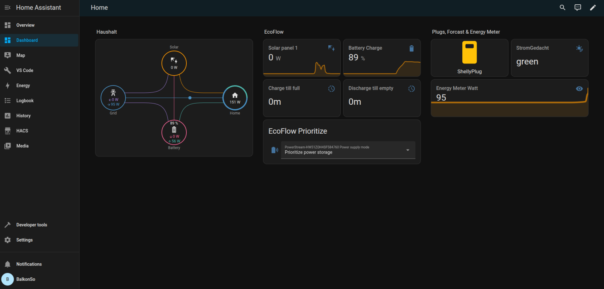
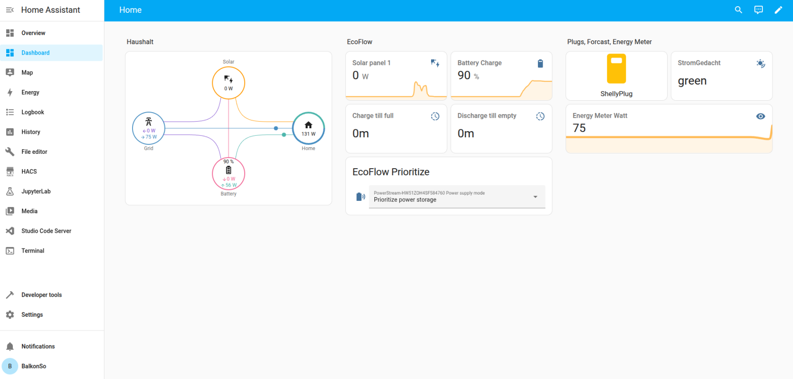

# blackforesthackathon
This repo contains the output of team section77 at the #blackforesthackathon in May 2025 in Freiburg. The chosen challenge was BalkonSolar: "Optimizing Small-Scale Storage and Plug-In Solar for Grid Stability and Cost Savings"

[Challenge details](https://www.blackforesthackathon.de/challenges-data-decoded/):

🔍 Problem Statement: Small-scale battery storage for plug-in solar systems is not optimized for grid demand. Users charge batteries based on electricity prices rather than grid conditions, possibly overloading the grid at peak solar production times while missing opportunities to use excess renewable energy. There are no dynamic incentives for prosumers to adjust their energy use, leading to inefficiencies in balancing supply and demand.

🎯 HACKATHON CHALLENGE: How might we develop an innovative solution that helps prosumers (users with solar and storage) optimize their energy consumption and feed-in behavior to support grid stability, reduce CO₂ emissions, and maximize financial benefits?

📊 Available Data & Resources: Real-time electricity prices & grid demand APIs, Weather forecasts for solar power predictions, Battery & inverter data for energy flow insights, Smart home hardware (sockets, sensors, tablets, etc.) for prototyping

🏆 Success Criteria: A successful solution should balance the grid by optimizing consumption and feed-in based on demand, reduce CO₂ impact by using green electricity efficiently, maximize financial benefits for prosumers and be simple, user-friendly, low-cost, open-source, and scalable.

💡 Key Considerations: The solution should prioritize simplicity, low costs, ease of implementation,
open-source accessibility, and clear documentation to ensure widespread adoption and usability.

## Team members
- [Protea-Wolkenfee](https://github.com/Protea-Wolkenfee)
- [Jana](https://github.com/jaaana)
- [A.s.](https://github.com/adRn-s)
- [DrR00T90](https://github.com/DrR00T90)
- [Justin Otherguy](https://github.com/justinotherguy)
- [Yannick Minet](https://github.com/minetman)
- [EtikettierJuergen](https://chaos.social/@justinotherguy/114483033539956358)

# our solution: baso-smart
## Brief description of the solution
On the basis of readily avaible components (cheap off the shelf hardware like Raspberry Pi, optical readout head, smart sockets, ...) and open source software (HomeAssistant, Tasmota, ...) we have created a solution that tightly integrates into HomeAssistant (HomeAssistant integration) and is easy to install even for a less tech-savy user.

## Installation steps
- download HomeAssistant SD card image and install on SD card [for Raspberry Pi](https://www.home-assistant.io/installation/raspberrypi)
- start HomeAssistant and do basic configuration
- install integrations for the components
  - Mosquitto MQTT broker 
  - [HACS (HomeAssistant Community Store)](https://hacs.xyz/docs/use/)
    - EcoFlowCloud
    - Power Flow Card Plus
- install the integration from the directory `code/custom_components/basosmart-integration/`
- install the blueprint `basosmart-blueprint.yaml`
- configure and save blueprint and fill in the data:
  - PV Peak power of your PV system
  - ZIP code of your location
  - Latitude of your geo position
  - Longitude of your geo position
  - Angle at which your PV system is setup
  - Alignment of your PV system

## Produced output
- documentation
  - [Presentation](https://new.express.adobe.com/id/urn:aaid:sc:EU:eb22591b-47b1-543f-af10-bcdc7bdd499b?invite=true&accept=true&promoid=YXPZFV9S&mv=other)
  - HomeAssistant specific
    - how to install integrations
      - integration "Forecast.Solar"
          - log into HomeAssistant
          - Settings
          - Devices & services
          - Add integration
          - Search "Forecast.Solar"
      - [integration "Python Scripts"](https://www.home-assistant.io/integrations/python_script)
          - edit your configuration.yaml
          - add "python_script:"
          - create the folder <config>/python_scripts
          - Create a file <config>/python_scripts/hello_world.py in the folder and give it this content:
              ```Python
              # `data` is available as builtin and is a dictionary with the input data.
              name = data.get("name", "world")
              # `logger` and `time` are available as builtin without the need of explicit import.
              logger.info("Hello {} at {}".format(name, time.time()))
              ```
          - Start Home Assistant to reload the script configuration.
          - Call your new python_script.hello_world action (with parameters) from the Actions, using the YAML mode.
              ```YAML
              action: python_script.hello_world
              data:
                  name: "Input-Text"
              ```
    - [how to generate a long lived access token](https://community.home-assistant.io/t/how-to-get-long-lived-access-token/162159)
      - log into HomeAssistant
      - click on your profile icon on the bottom left
      - click on the tab "Security"
      - section: "Long-lived access tokens"
      - create token
    - [how to integrate python scripts into HomeAssistant](https://www.home-assistant.io/integrations/python_script/)
  - Forecast.Solar
    - how to create an 
  - battery charing algorithm
      - optimized buffer use (to be included in the control):
          The charging and discharging process should be carried out as follows: At midnight, the battery storage system should be half charged so that it can serve the load until the start of the day. After sunrise, solar production quickly exceeds the load and the storage system, which is empty at this point, is gradually charged. If the daily yield corresponds to the annual average, the battery storage is filled to its capacity limit by the surplus electricity at sunset. On very high-yield days, the additional surplus electricity must be curtailed or utilised elsewhere once the capacity limit is exceeded. After darkness falls, the load is covered by the discharging current. At midnight, the battery is exactly half charged again and the cycle can begin anew. On low-yield days, the battery is only charged to a fraction of its capacity. The daily balance is negative and in this case must be compensated for by residual power plants or load reductions.
  - predictions are driven by parameters in sensors (Stromgedach, Forecast.Solar, and Historical Power Consumption*)
    * Check [balance-sensors.md](./balance-sensors.md) & see photos/mindmap{1,2,3}.png

## software 
  - [HomeAssistant](https://www.home-assistant.io/)
    - [documentation for download](https://www.home-assistant.io/installation/raspberrypi#downloading-the-home-assistant-image)
  - [StromGedacht API endpoint for Freiburg](https://api.stromgedacht.de/v1/now?zip=79110)
    - [integration for StromGedacht into HomeAssistant](https://community.home-assistant.io/t/stromgedacht-api-integration/568465)
  - [PV-Leistungsprognose](https://www.photovoltaikforum.com/wissen/entry/39-kostenfreie-photovoltaik-leistungsprognose-f%C3%BCr-10-tageszeitfenster-mit-kostenfre/)
  - [Solar energy prediction](https://openweathermap.org/api/solar-energy-prediction)
  - [Meteoblue API](https://content.meteoblue.com/de/unternehmensloesungen/wetter-apis)
  - configuration details for HomeAssistant
    <details>
    <summary>Dashboard in DARK theme</summary>
    
    
    </details>
    <!-- see our [raw_dashboard_data](./raw_dashboard_data) -->
    <details>
    <summary>Dashboard in LIGHT theme</summary>
    
    
    </details>

## hardware for prosumers
  - Rasperry Pi
  - Radio-controlled sockets
  - [Optical Readout Head for Smartmeter](https://www.ebay.de/sch/i.html?_nkw=hichi&_odkw=hichi)

## future improvements
- create a more generic solution, that is independent of HomeAssistant
- use APIs that provide a CO2 index and energy flow like 
  - [Grünstromindex](https://gruenstromindex.de/assets/js/)(preferred)
  - [Energy Charts](https://energy-charts.info/api.html?l=de&c=DE)
- Add more sophisticated prediction models e.g. AC charging, forecast with nonlinear-optimization algorithm and intraday optimization.

## Hurdles
- EcoFlowCloud plugin had a bug, switched over to `v1.3.0-beta4` (the HA interface allows picking betas or any git tag at its '...' menu.)
- access to the ecoflow api not provided
  - requires a developer account; activation takes a few days
  - registration is tricky (codes valid for 1 minute only, mail takes around 1 minute)
- Password for Wifi Router unknown -> reset password
- Password for HomeAssistant unknown -> reinstall ha os
- Optical readout head (by hichi) configured to only present total energy consumption -> edit script (and provide feedback to hichi, so he can change the default config to be more useful)
- Missing labels on the devices -> a job for [EtikettierJuergen](https://chaos.social/@justinotherguy/114483033539956358): print labels